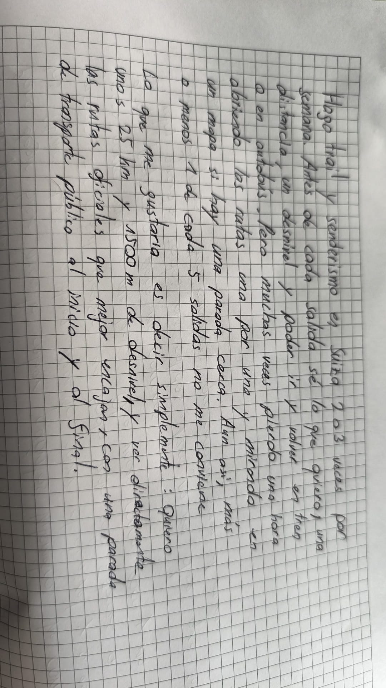

# Rutas de senderismo a medida en Suiza

## Problema

Cuando preparo una salida de senderismo en Suiza, sé lo que quiero: por ejemplo 25 km, 1500 m de desnivel positivo y poder llegar y volver en transporte público. Pero no encuentro fácilmente una ruta existente que cumpla todo esto a la vez.

No puedo hacerlo a mano porque hay cientos de rutas oficiales, muchas divididas en etapas, y tengo que comprobar varios criterios a la vez: la distancia, el desnivel y si hay una parada cerca del inicio y del final. Para cada ruta tendría que calcular estos datos y después filtrar las que me sirven.

## ¿De dónde viene este problema?

Hago trail y senderismo en Valais. Para entrenar, necesito salidas con una distancia y un desnivel concretos, y tengo que poder ir en tren o en autobús.

Preparo una salida así 2 o 3 veces por semana. Cada vez tengo que abrir las rutas una por una para ver la distancia y el desnivel, y después mirar en un mapa si hay una parada cerca. Esto me lleva fácilmente una hora. Aun así, más o menos 1 de cada 5 salidas no me conviene: es demasiado corta, demasiado dura o no hay autobús para volver.

Ya existen aplicaciones de rutas, pero no están hechas para Suiza. Usan rutas subidas por los usuarios y no los datos oficiales y actualizados de la Confederación.

Muchos corredores y senderistas sin coche tienen el mismo problema.

## ¿Qué datos existen ya?

Todos estos datos son oficiales, gratis y se pueden descargar:

- **Las rutas**: la Oficina Federal de Carreteras (ASTRA) publica «Wanderland Schweiz», con todas las rutas de senderismo nacionales, regionales y locales de Suiza. Se actualiza varias veces al año.
- **La altitud**: swisstopo publica el modelo de altitud oficial de toda Suiza (swissALTI3D).
- **Las paradas de transporte público**: opentransportdata.swiss publica la lista oficial de las estaciones y paradas de Suiza, con sus coordenadas.

## ¿Por qué no es un simple «buscar y mostrar»?

Las rutas no dan directamente la distancia, el desnivel ni la duración. Hay que:

1. **Calcular** la distancia, el desnivel y el tiempo estimado a partir de los puntos y de la altitud oficial.
2. **Encontrar** la parada más cercana al inicio y al final, y comprobar que está a menos de un kilómetro.
3. **Filtrar y ordenar** las rutas según lo cerca que están de lo que se pide.

## ¿Por qué en la nube?

Muchos senderistas y corredores tienen la misma necesidad y usan los mismos datos oficiales. Tiene sentido que estos datos y los cálculos estén en un solo sitio, compartido por todos, y que se actualicen cuando la Confederación publica nuevos datos.

## Referencias

- Wanderland Schweiz (ASTRA): https://opendata.swiss/de/dataset/langsamverkehr-wanderland-schweiz
- swissALTI3D (swisstopo): https://www.swisstopo.admin.ch/fr/modele-altimetrique-swissalti3d
- Paradas de transporte público: https://opentransportdata.swiss/en/cookbook/masterdata-cookbook/servicepoints/

## Tarjeta de rol

## Documentación adicional

- [configuración GitHub](docs/ssh_github.png)
- [configuración SSH](docs/ssh_test.png)